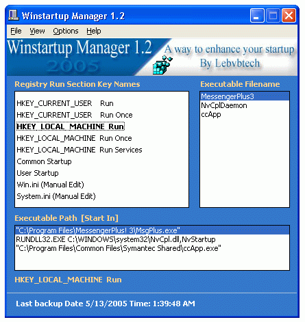



## Winstartup Manager 1\.2 Final code

### Description

After many releases as well as many ideas came out from me, finally i've decide to post the final code for [ Winstartup Manager v 1.2 ] that i've completed, hopefully bug free, nice GUI and required functions and ready for setup, to be honest i still need a small help on win9x machine the Taskman auto kill command, well i wont talk much see the code in task termination commented. Thank you so much any vote or comments happily appreciated.
 
### More Info
 
Don't mess with your regedit if you are not advanced pc user and if you dont know what are you doing and or deleting better to stop here:)

             |
---                |---
**Submitted On**   |2005-05-05 00:06:06
**By**             |[kegham](https://github.com/Planet-Source-Code/PSCIndex/blob/master/ByAuthor/kegham.md)
**Level**          |Intermediate
**User Rating**    |4.6 (23 globes from 5 users)
**Compatibility**  |VB 5\.0, VB 6\.0
**Category**       |[Windows System Services](https://github.com/Planet-Source-Code/PSCIndex/blob/master/ByCategory/windows-system-services__1-35.md)
**World**          |[Visual Basic](https://github.com/Planet-Source-Code/PSCIndex/blob/master/ByWorld/visual-basic.md)
**Archive File**   |[Winstartup1887605122005\.zip](https://github.com/Planet-Source-Code/kegham-winstartup-manager-1-2-final-code__1-60508/archive/master.zip)

